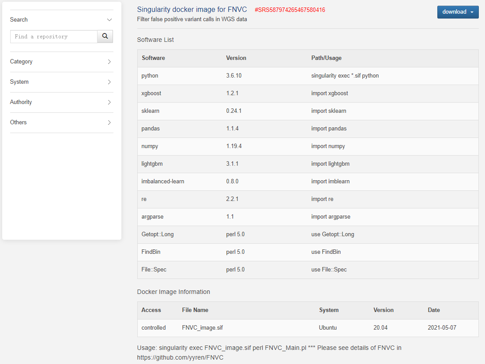

# System environment
FNVC provides a singularity docker image with all dependent environments. This make the results reproducible and make it easier to be used in different system environment. 

Users can download the singularity image from our docker image sofware responsibility 

Docker image for variant calling
------------
http://bmap.sjtu.edu.cn/softstorage/details/21

 

Docker image for FNVC
------------
http://bmap.sjtu.edu.cn/softstorage/details/22

 

OR manually install the requirements with the version equal or later: 

Python Requirements
------------
* python v3.6.10
* xgboost v1.1.1
* scikit-learn v0.23.0
* pandas v1.0.4
* numpy v1.18.4
* lightgbm v3.1.0
* imbalanced-learn v0.7.0
* re v2.2.1
* argparse v1.1
* os 
* collections 
* math
* itertools
* datetime
* sys

Perl Requirements
------------
* perl v5.0
* Getopt::Long
* FindBin
* other customized models (###.pm) are released in FNVC folder

