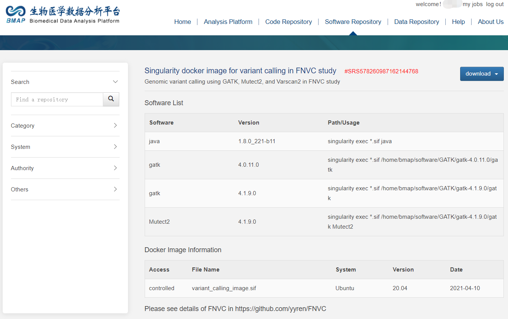
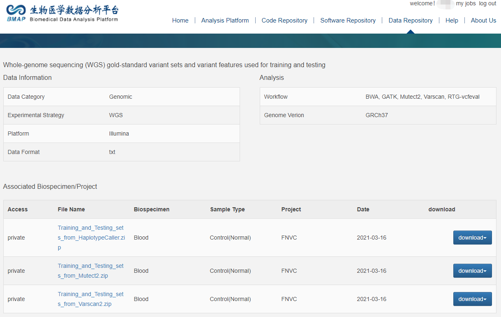

# FNVC
FNVC: Filtering on next-generation WGS variant calls 

It is freely available for academic use, but the copyrights of all the original gold-standard data belong to the GIAB organizations. 

Introduction
------------
  Whole-genome sequencing (WGS) is frequently used in large-scale population genetic research and the medical diagnosis of congenital or acquired disorders. Here, we show that benchmark samples contain substantial false-positive variants from WGS analysis, ranging from ~7,000 to ~64,000 out of 3 million gold standard variants from GATK, Varscan2, and Mutect2, indicative of the risk of misleading the diagnosis or the genetic study. The previous developed filtering methods eliminate nearly ~48-71% (~2,145-2,845), ~43-68% (~16,690-24058), and ~7-92% (~2,532-29,689) false-positive variants correspondingly. 

  Unfortunately, ~1.3-41.3 times true-positive variants (~3,700-79,000) were eliminated simultaneously. We present a filtering protocol FNVC based on gradient boosting decision tree-based method to eliminate ~73-90% false-positive variants and decrease the loss of true-positive variants from tens of thousands to less than 1000 average.  
  
  We show that FNVC demonstrates the most accurate performance with the highest AUC, Matthews correlation coefficient (MCC), and F1-minor score. Furthermore, it is the only method that consistently eliminates more false-positive variants than the loss of true-positive variants (log OFO <0). 

 

 

Usage
------------
### Filtering
perl FNVC_Main.pl \
	-t annotation -c gatk \
	-snpm gatk_snp.model im gatk_indel.model\
	-i input.vcf -o /home/ubuntu/output.vcf

### Incremental training
Incremental training with pre-trained model and additional data
perl FNVC_Main.pl \
	-t retrain -c gatk \
	-tp TP.vcf -fp FP.vcf \
	-snpm gatk_snp.model -im gatk_indel.model \
	-o /home/ubuntu/gatk_retrained

Computational Environment
------------
Users can download the singularity image from our docker image sofware responsibility 

### Docker image for variant calling
http://bmap.sjtu.edu.cn/softstorage/details/11

 

### Docker image for FNVC
http://bmap.sjtu.edu.cn/softstorage/details/10

 

OR manually install the requirements with the version equal or later: 

### Manually install
##### Python Requirements
* python v3.6.10
* xgboost v1.1.1
* scikit-learn v0.23.0
* pandas v1.0.4
* numpy v1.18.4
* lightgbm v3.1.0
* imbalanced-learn v0.7.0
* re v2.2.1
* argparse v1.1
* os 
* collections 
* math
* itertools
* datetime
* sys

##### Perl Requirements
* perl v5.0
* Getopt::Long
* FindBin
* other customized models (###.pm) are released in FNVC folder

Data
------------
Sequencing alignment, marking duplicates, and local realignment were performed using the BWA-MEM, Dedup, and Realigner that are integrated into Sentieon. 
The germline variants were identified using GATK HaplotypeCaller(version 4.0.11, with default parameters) and Mutect2 (Integrated in GATK version 4.1.9 with default parameters) and Varscan2 (version 2.3.9 with default parameters, except where --min-coverage 3, --p-value 0.10, --min-var-freq 0.01). 

The variant calling process can be found in the 'Variant Calling/variant_calling.sh' 

The true-positive variants and false-positive variants were defined based on the consistency of the variant calls with the high confident variant calls from NIST’s GIAB consortium (version 3.3.2) using RTG-vcfeval method and regardless of the zygosity differences via setting the argument --squash_ploidy. 

The details of the data can be found in the folder 'Data for Training and Testing'. 

### Leave one individual out cross validation study data
The training and testing data used for the leave one individual out cross validation study are available in the:  

http://bmap.sjtu.edu.cn/datastorage/main/17 
 

### High-confident variants in vcf format

The high-confident variants released by GIAB can be download from:  

https://github.com/genome-in-a-bottle/giab_latest_release  

### High-confident variants in fastq or bam format
The raw sequencing data used in the paper are available in the:  

https://github.com/genome-in-a-bottle/giab_data_indexes/tree/master/  
